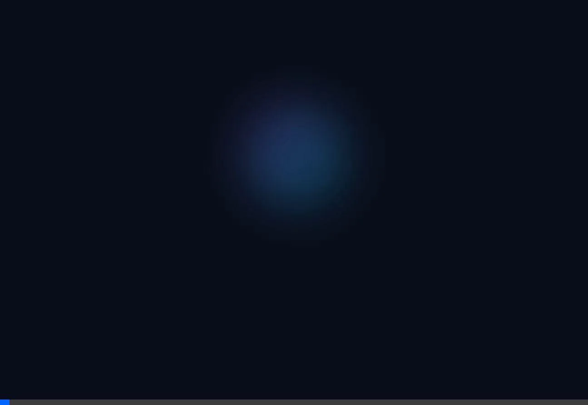

<div align="center">

# 🚀 ALPHA Portfolio

### Personal Portfolio Website by Farid Al Farizi

[](https://developer.mozilla.org/en-US/docs/Web/HTML)
[](https://developer.mozilla.org/en-US/docs/Web/CSS)
[](https://developer.mozilla.org/en-US/docs/Web/JavaScript)

<p align="center">
  
</p>

**A modern, responsive portfolio website showcasing my journey as a Developer & Tech Enthusiast**

[🌐 Live Demo](#) • [📧 Contact](mailto:farid.alfarizi2305@gmail.com) • [💼 LinkedIn](https://www.linkedin.com/in/faridalfarizi) • [📸 Instagram](https://www.instagram.com/kasasteril)

---

</div>

## ✨ Features

| Feature | Description |
|---------|-------------|
| 🎨 **Modern Design** | Sleek dark theme with gradient accents and glassmorphism effects |
| 📱 **Fully Responsive** | Optimized for all devices - desktop, tablet, and mobile |
| ⚡ **Smooth Animations** | Beautiful CSS animations and transitions throughout |
| 🌟 **Interactive Elements** | Floating cards, parallax effects, and hover interactions |
| 🔗 **GitHub Integration** | Auto-fetches latest projects from GitHub API |
| 🎭 **Splash Screen** | Elegant loading animation with logo reveal |
| ⭐ **Animated Background** | Dynamic starfield with gradient overlays |

## 🛠️ Tech Stack

<div align="center">

### Frontend


### Skills Showcased


</div>

## 📂 Project Structure

```
📦 Web Portfolio
├── 📄 index.html          # Main HTML structure
├── 🎨 styles.css          # All styling and animations
├── ⚡ script.js           # Interactive functionality
├── 🖼️ alpha logo.svg      # Brand logo
├── 📁 assets/             # Media assets
│   └── 🎬 splash-demo.webp   # Splash screen animation
├── 📖 README.md           # Documentation
└── 📜 LICENSE             # MIT License
```

## 🚀 Quick Start

### Clone the repository
```bash
git clone https://github.com/Frdalf/portfolio.git
```

### Navigate to project directory
```bash
cd portfolio
```

### Open in browser
Simply open `index.html` in your preferred browser, or use a local server:

```bash
# Using Python
python -m http.server 8080

# Using Node.js (with live-server)
npx live-server
```

## 📸 Preview

<div align="center">

### 🎬 Splash Screen Animation


</div>

### 🏠 Home Section
> Hero section with animated profile, floating tech cards, and call-to-action buttons

### 👤 About Section
> Personal introduction with floating Web3 & Data Science icons (Bitcoin, Ethereum, Python, etc.)

### 💡 Skills Section
> Comprehensive skill cards covering Frontend, Backend, Web3, Tools, and Data Science

### 🗂️ Projects Section
> Dynamic project showcase with GitHub API integration and featured projects

### 📬 Contact Section
> Contact form and social links for easy communication

## 🎨 Color Palette

| Color | Hex | Usage |
|-------|-----|-------|
| 🟣 Primary | `#8a63ff` | Main accent color |
| 🔵 Secondary | `#00d4ff` | Highlights & links |
| 🩷 Accent | `#ff6b9d` | Special elements |
| ⚫ Background | `#0a0e1a` | Main background |
| 🌑 Card BG | `#151b2e` | Card backgrounds |

## 📱 Responsive Breakpoints

- **Desktop:** 1200px and above
- **Tablet:** 768px - 1199px
- **Mobile:** Below 768px

## 🤝 Connect With Me

<div align="center">

[](https://github.com/Frdalf)
[](https://www.instagram.com/kasasteril)
[](https://www.linkedin.com/in/faridalfarizi)
[](mailto:farid.alfarizi2305@gmail.com)

</div>

## 📄 License

This project is open source and available under the [MIT License](LICENSE).

---

<div align="center">

### ⭐ Star this repo if you find it helpful!

Made with 💜 by **Farid Al Farizi**

*© 2026 ALPHA Portfolio. All rights reserved.*

</div>
